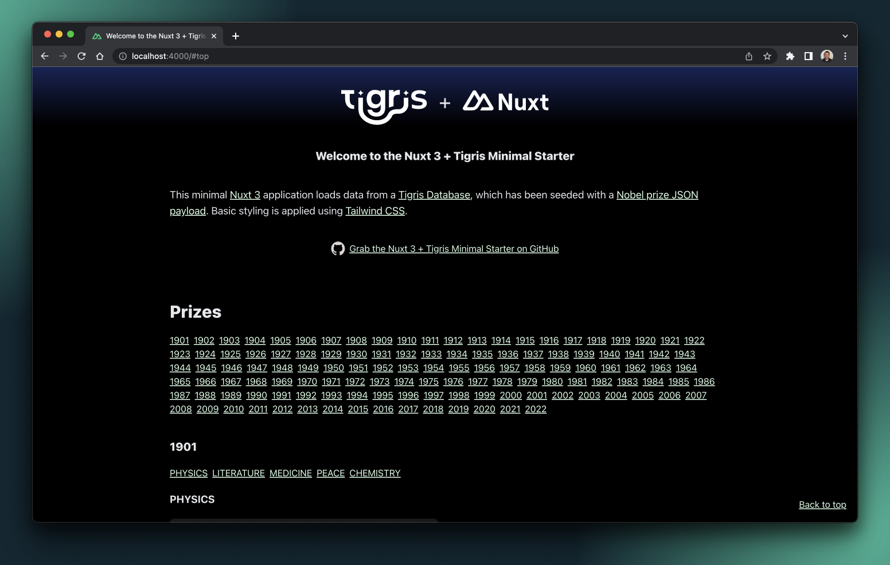

# Nuxt 3 with Tigris Minimal Starter



To learn more, check out:

- [Tigris documentation](https://www.tigrisdata.com/docs/?utm_source=nuxt-3-template&utm_medium=code&utm_campaign=nuxt-3-template)
- [Nuxt 3 documentation](https://nuxt.com/docs/getting-started/introduction)

## Setup

Make sure to install the dependencies:

```bash
# yarn
yarn install

# npm
npm install

# pnpm
pnpm install
```

## Tigris Project

Run the following command. You will need to create a Tigris Cloud account or
login to an existing account to authenticate the Tigris CLI:

```sh
npm run tigris:init
```

This will create a project in Tigris Cloud and store your Tigris project
configuration in a `.env` file.

With the project config in place, seed the Tigris Database with data:

```sh
npm run tigris:seed
```

## Development Server

Start the development server on `http://localhost:3000`

```bash
npm run dev
```

## Production

Build the application for production:

```bash
npm run build
```

Locally preview production build:

```bash
npm run preview
```

Check out the
[deployment documentation](https://nuxt.com/docs/getting-started/deployment) for
more information.
